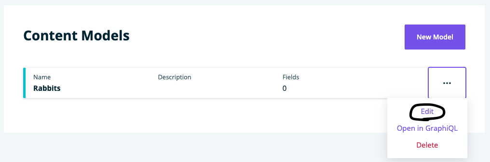

**Note**: These tutorials assume that you have already [installed the plugin](../../introduction.mdx).

## Edit a Model

A model is a container that holds fields for use in content generation in publisher.

### Steps to Edit a Model
---
1. Click on Content Modeler in the WordPress side menu

    

1. If it's not on Models, click Models under Content Modeler in the WordPress side menu

1. Click the triple dot menu for a Model and click on Edit in the popup menu

    

1. Edit the fields to fit your needs

1. Click Save to update the model or click Cancel to undo the Model edits

    

## Feedback
---
- **Questions?** Email us ce-beta@wpengine.com
- **Feedback**: Your feedback helps shape the future of Content Engine. To provide feedback, fill out our [Content Engine Feedback Form](https://docs.google.com/forms/d/e/1FAIpQLSecvuZ_EMiTIOlTSwcW1JnPQcFbAcCOwGlhURkzBI8Ps9vFzA/viewform).
