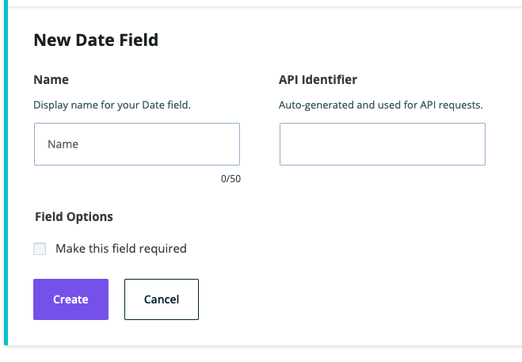

**Note**: These tutorials assume that you have already installed the plugin and created a model.

## Date Field

The date field is used for proper dates.

### Steps to Use the Date Field

1. After navigating to a model, click the + button or if it's the first field, click on the Date option

2. Choose the Date Field type
3. Fill in the form fields to fit your needs

4. Click Create when done to save the field to the model
5. Click Cancel to stop field creation

## Feedback

- **Questions?** Email us ce-beta@wpengine.com
- **Feedback**: Your feedback helps shape the future of Content Engine. To provide feedback, fill out our [Content Engine Feedback Form](https://docs.google.com/forms/d/e/1FAIpQLSecvuZ_EMiTIOlTSwcW1JnPQcFbAcCOwGlhURkzBI8Ps9vFzA/viewform).
