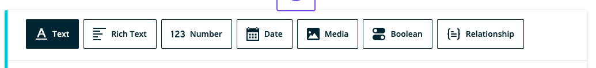

**Note**: These tutorials assume that you have already [installed the plugin](../../introduction.mdx).

## Relationship Field

The media field is used to include images and other files.

### Steps to Use the Relationship Field
---
1. After navigating to a model, click the + button or if it's the first field, click on the Relationship option

    

1. Choose the Relationship Field type

1. Fill in the form fields to fit your needs

    

1. Click Create when done to save the field to the model

1. Click Cancel to stop field creation

## Feedback
---
- **Questions?** Email us ce-beta@wpengine.com
- **Feedback**: Your feedback helps shape the future of Content Engine. To provide feedback, fill out our [Content Engine Feedback Form](https://docs.google.com/forms/d/e/1FAIpQLSecvuZ_EMiTIOlTSwcW1JnPQcFbAcCOwGlhURkzBI8Ps9vFzA/viewform).
