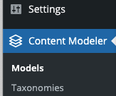
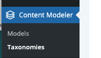
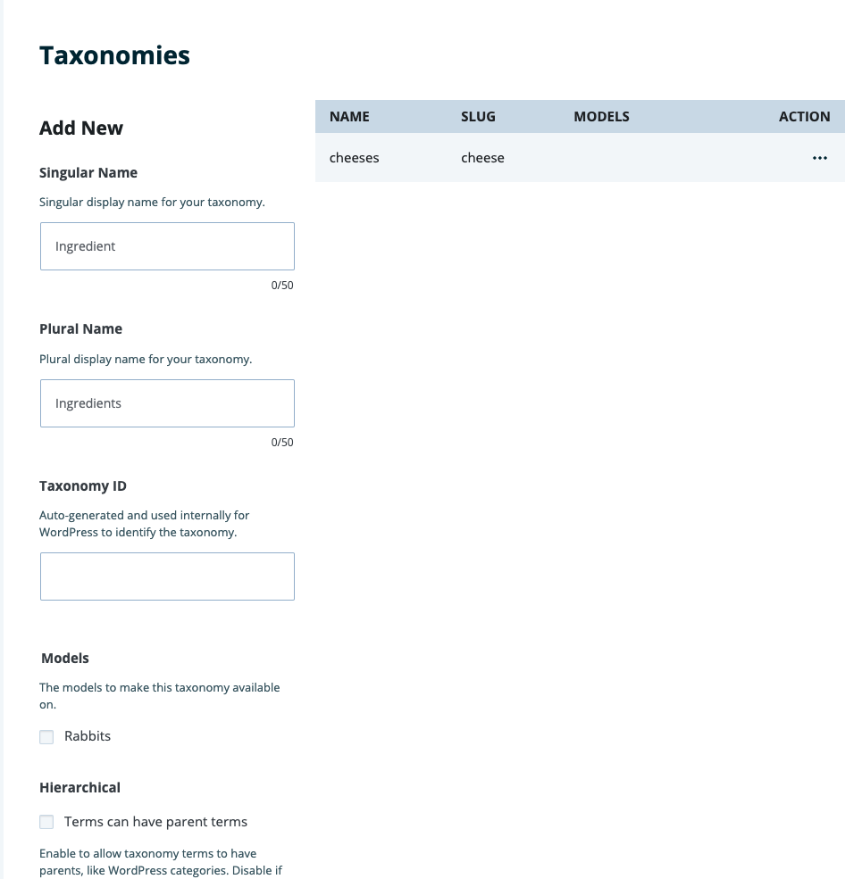

**Note**: These tutorials assume that you have already [installed the plugin](../../introduction.mdx).

## Create a Taxonomy

A taxonomy is a way of grouping posts together based on a select number of relationships.

### Steps to Create a Taxonomy
---

1. Click on Content Modeler in the WordPress side menu

    

1. If it's not on Taxonomies, click Taxonomies under Content Modeler in the WordPress side menu

    

1. You will then see the form to Add a Taxonomy and the current Taxonomies table

    

1. Fill in the fields to fit your needs

1. Taxonomy Id is auto generated but you can change it to suite your needs

1. Click Create to save the Taxonomy, it will be added to the table

## Feedback
---
- **Questions?** Email us ce-beta@wpengine.com
- **Feedback**: Your feedback helps shape the future of Content Engine. To provide feedback, fill out our [Content Engine Feedback Form](https://docs.google.com/forms/d/e/1FAIpQLSecvuZ_EMiTIOlTSwcW1JnPQcFbAcCOwGlhURkzBI8Ps9vFzA/viewform).
