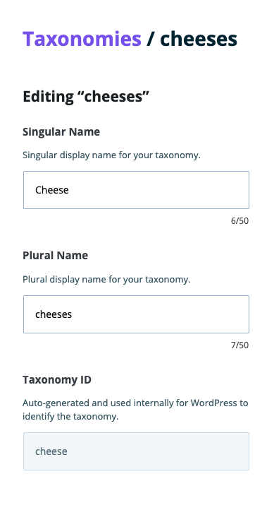
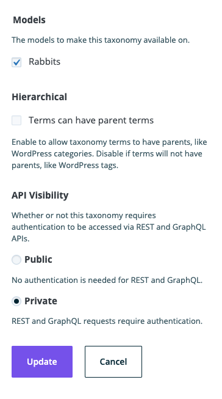

**Note**: These tutorials assume that you have already [installed the plugin](../../introduction.mdx).

## Edit a Taxonomy

A taxonomy is a way of grouping posts together based on a select number of relationships.

### Steps to Edit a Taxonomy
---

1. Click on Content Modeler in the WordPress side menu

    

1. If it's not on Taxonomies, click Taxonomies under Content Modeler in the WordPress side menu

    

1. You will then see the form to Add a Taxonomy and the current Taxonomies table

    

1. Click the triple dot menu next to the Taxonomy you want to Edit and click on Edit in the popup menu

    

1. You will see the Taxonomy Edit form

    

1. Click Update to save the updated taxonomy or click Cancel to undo the edits

    

## Feedback
---
- **Questions?** Email us ce-beta@wpengine.com
- **Feedback**: Your feedback helps shape the future of Content Engine. To provide feedback, fill out our [Content Engine Feedback Form](https://docs.google.com/forms/d/e/1FAIpQLSecvuZ_EMiTIOlTSwcW1JnPQcFbAcCOwGlhURkzBI8Ps9vFzA/viewform).
