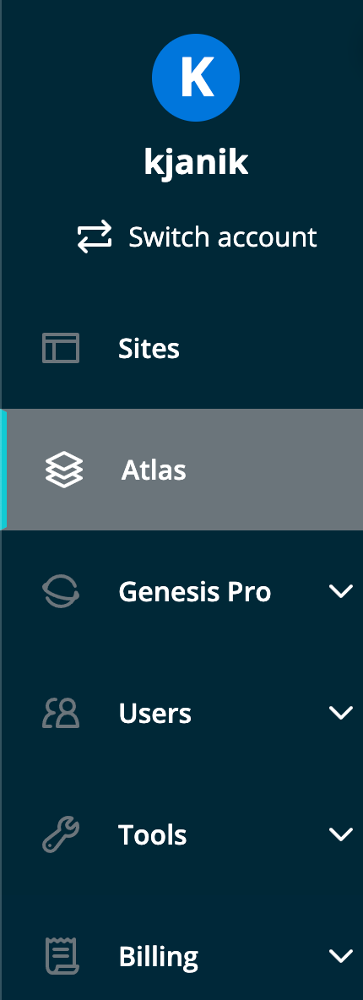

You can also deploy your application in the Atlas portal.

Log in to the [User Portal](https://my.wpengine.com) to create, update, delete, and troubleshoot headless apps on Atlas.

## View your headless apps

If your account is enabled on the Atlas platform, you should see **Atlas** in the portal menu:

## Creating an App

Select the **Get started** button. As you work through the deployment wizard, Atlas verifies that you have the following:

- A GitHub repository URL
- A Node.JS project inside your chosen GitHub repository
- An idea of which WordPress environment you want your app to be linked

Select **Get Started** to continue. The wizard then asks for the following information:

### Repository Settings

Fill in the GitHub repository address and authorize WP Engine to access said repository. If this is your first time allowing WP Engine to access the repository:

1. Select **Check Status**. GitHub opens in a separate tab.
2. On the "Install WP Engine Headless" page, a list of GitHub organizations you belong to appears. Select the organization that contains the repository you plan on adding.
3. WP Engine Headless adds itself to your account settings, giving it:
   - Read access to code and metadata
   - Read and write access to repository hooks
4. (Optional) By default, WP Engine Headless gives itself read and write access to all current and future repositories in your account. You can switch this to only grant WP Engine permissions for a repository you select. In the "Repository access" section, check **Only select repositories**, then pick the repository you wish to grant access to in the dropdown menu. Select **Save**, and WP Engine will only access the selected repository.

### WP Engine Settings

WP Engine Settings include the following:

- **Atlas app name** - The name of your app should be related to the site you are creating. It will be the logical container for your environments (e.g., production, dev, etc.).
- **Atlas app region** - The region used for all environments within this app.

GitHub opens in a separate tab when you select continue, requesting permissions to change and monitor the repository. Select **Authorize WP Engine Headless**.

### Environments

Environments create a GitHub branch in your repository that acts as your environment. The screen includes the following:

#### Headless environment name

During app creation, you will create your first environment (i.e., staging, production). You can add more environments after the initial app creation. We recommend making your first environment a development environment, so you can test your app on the Atlas platform before creating a production environment. However, you can name the environment anything you want.

#### Link to a WordPress environment

Every headless environment is associated with a WordPress environment via the site environment name. Find the environment name in the portal under your WordPress site and that site's associated environment. Look for the **headlesswpe** prefix in the URL for your WordPress site (e.g., **headlesswpe**.wpengine.com or **headlesswpe**.wpenginepowered.com )

#### Environment Variables

Environment variables are key/value pairs. The key must be alphanumeric with no spaces, and the value can be any string input.

Environment variables are OS-level environment variables that will be available to your app during the build step (`npm run wpe-build`) and at runtime (`npm start`). In node, you can access the variables via `process.env.KEY`.

The headless framework requires two environment variables which are in your `.env.local` file:

- `WORDPRESS_URL` - The location of your WordPress instance
- `WP_HEADLESS_SECRET` - The secret found in the plugin via Settings->Headless in WP admin.

Add these environment variables to continue.

### Create App

Once you've filled out the form, select the **Create app** button.

If there aren't any errors, the environment page appears to see the status of your headless app environment. At first, it will be in a "Building code" status. It should look like this:

Once the build is complete, you can view your site running at the **Atlas URL** :tada:

**Note:** If your build failed, you could click the build logs found below environment Variables to investigate what went wrong.

Now let's check out our configured [developer workflow](./developer-workflow).
